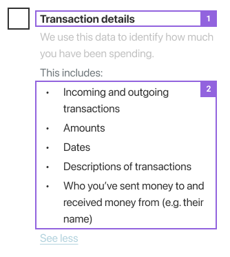

##Consumer Experience Standards

###Data Language Standards

>
  
Example of data language standards presented in a consumer-facing interaction

In accordance with CDR Rule 8.11 (1)(d), a data standard must be made to provide descriptions of the types of data to be used by CDR participants in making and responding to requests. Adherence to this language will help ensure there is a consistent interpretation and description of the consumer data that will be shared across different CDR implementations.

|#|Area|CX Standard|
|-|--------------------|------------------------------------------|
|1|**Data Language Standards:** Language to be used|Data Recipients and Data Holders MUST use data language standards to describe data clusters and permissions in consumer-facing interactions as outlined in [Table 1](#consumer) Data language standards <b>MUST</b> be used when CDR data is being requested, reviewed, or access to such data is withdrawn.<ul><li>Data language standards <b>MUST</b> be used when CDR data is being requested, reviewed, or access to such data is withdrawn.</ul></li><ul><li>Data Recipients and Data Holders <b>MUST</b> use the appropriate data standards language for business consumers as denoted with an ‘\*’ in [Table 1](#consumer)</ul></li><ul><li>Data Recipients and Data Holders <b>SHOULD</b> expand on the proposed language where appropriate to communicate further details of what is being shared.</ul></li><ul><li>Additional details <b>MAY</b> include additional information in context, such as in-line help or tool tips, and/or additional permissions where they may exist. denoted with an ‘†’ in Table 1</li><li>Examples of permission details that MAY be used and provided as in-line help are denoted with an ‘†’ in [Table 1](#consumer)</li></ul></ul>|
|2|**Data Language Standards:** Detailed scope requests|If a scenario requires it, Data Holders and Data Recipients **MUST** merge and amend Basic and Detailed data cluster and permission language to show that Detailed scopes include Basic data. <ul><li>Data Holders and Data Recipients **MUST** use the alternative language denoted with an ‘‡’ in [Table 1](#consumer) (rows greyed out for clarity).</ul></li>|

####Individual Consumer
Table 1.

|Data cluster language|Permission language|Authorisation Scopes|
|----------------------|------------------------------|-------------------|
|**Name and occupation**|<ul><li>Name</li></ul><ul><li>Occupation</li></ul>|common:customer.basic:read|
|**Contact Details**|<ul><li>Phone;</li></ul><ul><li>Email address;</li></ul><ul><li>Mail address;</li></ul> <ul><li>Residential address;</li></ul>|common:customer.detail:read|
|**Name, occupation, contact details:**|<ul><li>Name;</li></ul> <ul><li>Occupation;</li></ul> <ul><li>Phone;</li></ul><ul><li>Email address;</li></ul> <ul><li>Mail address;</li></ul><ul><li>Residential address;</li></ul>|common:customer.detail:read|

####Business consumer
Table 1.

|Data cluster language|Permission language|Authorisation Scopes|
|----------------------|------------------------------|-------------------|
|Organisation profile*|<ul><li>Agent name and role;</li></ul><ul><li>Organisation name;</li></ul><ul><li>Organisation numbers (ABN or ACN);</li></ul><ul><li>Charity status;</li></ul><ul><li>Establishment date;</li></ul><ul><li>Industry;</li></ul><ul><li>Organisation type;</li></ul><ul><li>Country of registration;</li></ul>|common:customer.basic:read|

|Data cluster language|Permission language|Authorisation Scopes|
|----------------------|------------------------------|-------------------|
|Organisation contact details*|<ul><li>Organisation address;</li></ul><ul><li>Organisation address;</li></ul><ul><li>Phone number;</li></ul>|common:customer.detail:read|

|Data cluster language|Permission language|Authorisation Scopes|
|----------------------|------------------------------|-------------------|
|Organisation profile and contact details*‡|<ul><li>Agent >name and role;</li></ul> <ul><li>Organisation name;</li></ul> <ul><li>Organisation numbers (ABN or ACN);† </li></ul><ul><li>Charity status;</li></ul> <ul><li>Establishment date;</li></ul><ul><li>Industry;</li></ul><ul><li>Organisation type;</li></ul><ul><li>Country of registration;</li></ul><ul><li>Organisation address;</ul></li><ul><li>Mail address;</li></ul><ul><li>address;</li></ul><ul><li>Phone number;</li></ul>|common:customer.detail:read|

###Accessibility Standards

|#|Area|CX Standard|
|-|------------------------------|----------------|
|3   | **Accessibility**  |At a minimum, all CDR participants **MUST** seek to comply with the following accessibility guidelines throughout the Consent Model.<ul><li>These standards SHOULD be assessed, tested, and refined further by accessibility consultants directly involved in implementation.</li></ul>   |
|  4 | **Accessibility**   Content distinction | Data recipients and data holders **MUST** seek to have all aspects of the Consent Model comply with [WCAG 1.4](https://www.w3.org/TR/UNDERSTANDING-WCAG20/visual-audio-contrast.html) Data recipients and data holders **MUST** seek to have all aspects of the Consent Model comply with. This will make it easier to see and hear content, including separate foreground information from the background. This will make it easier to see and hear content, including separate foreground information from the background.  |
| 5  | **Accessibility**   Keyboard functionality  | Data recipients and data holders **MUST** seek to have all aspects of the Consent Model comply with [WCAG 2.1](https://www.w3.org/TR/UNDERSTANDING-WCAG20/keyboard-operation.html). This will make all functionality available from a keyboard.  |
| 6  | **Accessibility**   Pointer interactions  | Data recipients and data holders **MUST** seek to have all aspects of the Consent Model comply with [WCAG 2.5](https://www.w3.org/WAI/WCAG21/Understanding/pointer-accessible) . This will make it easier to operate functionality using various input devices  |
| 7  | **Accessibility**   Reading experiences  | Data recipients and data holders **MUST** seek to have all aspects of the Consent Model comply with [WCAG 3.1](https://www.w3.org/TR/UNDERSTANDING-WCAG20/meaning.html). This will make text content readable and understandable  |
| 8  | **Accessibility**   Input assistance  | Data recipients and data holders **MUST** seek to have all aspects of the Consent Model comply with [WCAG 3.3](https://www.w3.org/TR/UNDERSTANDING-WCAG20/minimize-error.html). This will help users avoid and correct mistakes.  |

###Consent, Authenticate, and Authorise Standards

|#|Area|CX Standard|
|-|------------------------------|----------------|
| 9  | **Seeking consent**  | Data recipients **MUST** notify consumers of redirection prior to authentication.  |
| 10  | **Authentication:**   ‘One Time Password’  |  Data holders and data recipients **MUST** clearly refer to a “One Time Password” in consumer-facing interactions and communications. The use of the term “One Time Password” **MAY** be presented alongside an existing term used by a data holder (e.g. Netcode, one time pin etc.). |
| 11 | **Authentication:**  Passwords  |  Data holders and data recipients **MUST** state in consumer-facing interactions and communications that services utilising the CDR do not need access to consumer passwords for the purposes of sharing data. The exact phrasing of this is at the discretion of the data holder and data recipient. |
| 12  | **Authentication:**   Password link  | Data holders **MUST NOT** include forgotten details links in redirect screens. The inclusion of such links is considered to increase the likelihood of phishing attacks.  |
| 13  | **Authentication:**   OTP expiry  | Data holders **MUST** communicate the expiry period of the OTP to the consumer in the authentication flow.  |
| 14  |  **Authorisation** & Account selection | Data holders **MUST** allow the consumer to select which of their accounts to share data from if the data request includes account-specific data and if there are multiple accounts available. The Data holder **MAY** omit this step if none of the data being requested is specific to an account (e.g. Saved Payees).    Data holders **MAY** add a ‘profile selection’ step or equivalent prior to the account selection step if a single identifier provides access to different customer accounts. For example, one customer ID may give access to business customer and individual customer accounts. The ‘profile selection’ step **SHOULD** only be considered if it is an existing customer experience, and **SHOULD** be as minimal as possible to avoid introducing unwarranted friction (having regard to CDR Rule 4.24).<ul><li>If certain accounts are unavailable to share, data holders **SHOULD** show these unavailable accounts in the account-selection step.</li><ul><li>Data holders **SHOULD** communicate why these accounts cannot be selected, and this SHOULD be communicated as in-line help or as a modal to reduce on-screen content.</li><li>Data holders MAY provide instructions on how to make these accounts available to share, and this SHOULD be communicated as in-line help or as a modal to reduce on-screen content.</li><li>*Note: Unavailable accounts are to be interpreted in accordance with the rules on eligible consumers and required consumer data.</li></ul></ul>|

###Withdrawal Standards

|#|Area|CX Standard|
|-|------------------------------|----------------|
| 16 | **Withdrawing consent**  | If a data recipient does not have a general policy to delete redundant data, and the consumer has not already requested that their redundant data be deleted: <ul><li>Data recipients **MUST** allow consumers to elect to have their redundant data deleted as part of the withdrawal process prior to the final withdrawal step. </ul></li><ul><li>Data recipients **SHOULD** consider prompting consumers to exercise this right at appropriate times (e.g. when inaction on the part of the consumer may cause them to lose the opportunity to exercise the right to delete their redundant data).</ul></li>|
| 17  | **Withdrawing authorisation:**  Consequences  | As part of the withdrawal process, the data holder **MUST* advise the consumer to review the consequences of withdrawal with the data recipient before they stop sharing their data. <ul><li>The data holder MAY consider using or paraphrasing the following message(s):</li><ul><li>*‘You should check with [Data Recipient] before you stop sharing to understand the consequences.’*</ul></li><ul><li>*‘You should check with [Data Recipient] to see if your service will be impacted before you stop sharing.’*</li></ul></ul>|
| 18  | **Withdrawing authorisation:**   Redundant data  | As part of the withdrawal process, the data holder **MUST** inform the consumer about the handling of redundant data and the right to delete. <ul><li>The Data Holder **MAY** consider using or paraphrasing the following message(s):</li><ul><li>*‘CDR data is either deleted or de-identified when it is no longer required.’*</li><li>*‘[Data recipient] will have specific policies on how to handle your data once it’s no longer required.’*</li><li>*‘If you haven’t already, you can ask [data recipient] to delete your data when they no longer need it, but you must do this before you stop sharing.’*</li></ul></ul> |
